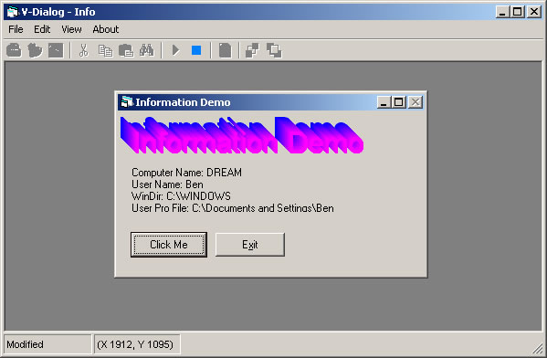



## Tiny Dev Environment

### Description

Hi this is my sort of Tiny Development Environment using the VBScript Control. anyway You can design your own little windows Apps in a matter of seconds. and also most I say most of vb code.

Projects comes with a form designer that you can resize move and psoition controls, test run projects in the IDE and finaly compile them. Please, Please see the read me first before doing anything it does have some information you need.

Anyway I hope you like the code. I am in the middle of updateing as uploading this one now. Have fun with it and please Vote.
 
### More Info
 

             |
---                |---
**Submitted On**   |2004-07-04 23:51:40
**By**             |[dreamvb](https://github.com/Planet-Source-Code/PSCIndex/blob/master/ByAuthor/dreamvb.md)
**Level**          |Advanced
**User Rating**    |4.8 (19 globes from 4 users)
**Compatibility**  |VB 6\.0
**Category**       |[Complete Applications](https://github.com/Planet-Source-Code/PSCIndex/blob/master/ByCategory/complete-applications__1-27.md)
**World**          |[Visual Basic](https://github.com/Planet-Source-Code/PSCIndex/blob/master/ByWorld/visual-basic.md)
**Archive File**   |[Tiny\_Dev\_E1795559192004\.zip](https://github.com/Planet-Source-Code/dreamvb-tiny-dev-environment__1-56250/archive/master.zip)

